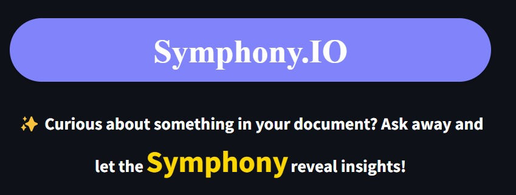
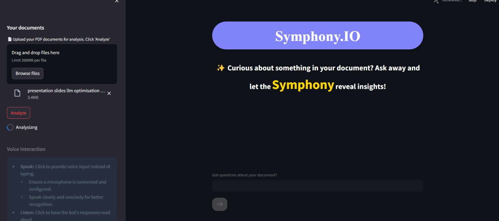

# Symphony.IO: Your Smart PDF Reader

[](https://opensource.org/licenses/MIT)




Symphony.IO is an intelligent PDF reader designed to provide seamless reading experiences through conversational interactions.

## Tech Stack

- **OpenAI**: Natural language processing for conversational interactions.
- **Hugging Face**: NLP models for text extraction and conversational AI.
- **Streamlit**: User-friendly interface development.
- **PyPDF2**: PDF text extraction.
- **SpeechRecognition**: Voice input handling.
- **gTTS**: Text-to-speech conversion.

## Installation

1. Clone this repository:
   ```bash
   git clone https://github.com/chowdhary19/SymphonyRead.git
   ```
2. Navigate to the project directory:
   ```bash
   cd SymphonyRead
   ```
3. Install dependencies:
   ```bash
   pip install -r requirements.txt
   ```

## Generating API Keys

To use Symphony.IO, you'll need to generate API keys for the following services:

- **OpenAI**: Visit [OpenAI's website](https://openai.com) to sign up and generate an API key.
- **Hugging Face**: Register on [Hugging Face's website](https://huggingface.co) and obtain an API key.

Once you have the API keys, create a `.env` file in the project directory and add the keys using the following format:

```
OPENAI_API_KEY=your_openai_api_key
HUGGING_FACE_API_KEY=your_hugging_face_api_key
```

## Usage

1. Run the Streamlit app:
   ```bash
   streamlit run app.py
   ```
2. Upload your PDF documents.
3. Interact with Symphony.IO:
   - Type questions in the text input field.
   - Click the microphone icon to speak aloud.
   - Click the speaker icon to listen to responses and download them locally.
4. Explore the insights provided by Symphony.IO!

## Screenshots


*Symphony.IO in action, providing conversational insights.*

## Acknowledgments

- Created by [Yuvraj Singh Chowdhary](https://github.com/chowdhary19)
- Inspired by [OpenAI](https://openai.com) and [Streamlit](https://streamlit.io)

## License

This project is licensed under the MIT License - see the [LICENSE](LICENSE) file for details.
